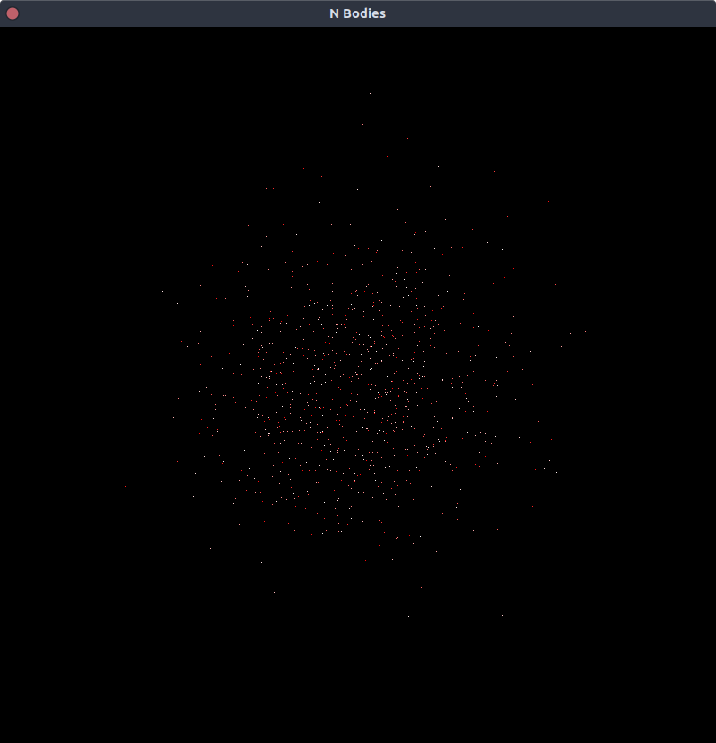

# nbodies

This is a simple, non-optimized program to simulate the n-body problem featuring the Barnes-Hut algorithm.

To launch, simply make sure you have the library `SDL2` installed. Then go at the root of the project, and run in your terminal `make nbodies N=1000` to launch the simulation with 1000 bodies.

